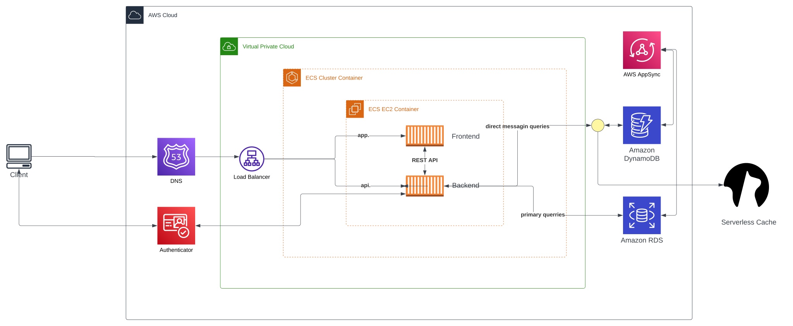
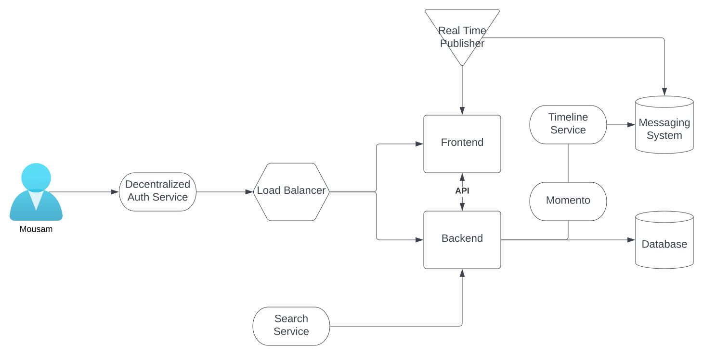

# Week 0 — Billing and Architecture# Week 0 — Billing and Architecture

1. IAM user created --- reset password
2. aws web console
   1. aws --version
   2. aws sts get-caller-identity
3. install aws console GitPod
   1. add access_key_id, secret_access_key, default_region of iam use in env
   2. test
   3. set up gitpod for relaunch with same config
      1. add config in gitpod.yml
         ```yml
         tasks:
             - name: aws-cli
                 env:
                 AWS_CLI_AUTO_PROMPT: on-partial
                 init: |
                 cd /workspace
                 curl "https://awscli.amazonaws.com/awscli-exe-linux-x86_64.zip" -o "awscliv2.zip"
                 unzip awscliv2.zip
                 sudo ./aws/install
                 cd $THEIA_WORKSPACE_ROOT
         ```
      2. set gitpod env variables
         ```
             gp env AWS_ACCESS_KEY_ID=zxt
             gp env AWS_SECRET_ACCESS_KEY=xyz
             gp env AWS_DEFAULT_REGION=us-east-1
         ```

## AWS CLI Budget

- add budget jsons
- set account id in env
- command
  ```bash
      aws budgets create-budget \
          --account-id $ACCOUNT_ID \
          --budget file://aws/json/budget.json \
          --notifications-with-subscribers file://aws/json/notifications-with-subscribers.json
  ```

## Create SNS

```
aws sns create-topic \
    --name my-topic
```

## Subscribe SNS

```
aws sns subscribe \
    --topic-arn arn:aws:sns:us-east-1:665214597604:my-topic \
    --protocol email \
    --notification-endpoint m.ousam@outlook.com
```

## Git Tags

```
git tag week0
git push --tags
```

### Recreate Logical Architectural Design



[Lucid Charts Share Link](https://lucid.app/lucidchart/86706ca2-c732-4122-8c87-c3450a9323b6/edit?viewport_loc=-742%2C-122%2C3328%2C1638%2C0_0&invitationId=inv_efa1991e-c004-412f-988e-f17edfcf62bf)

### Recreate Conceptual Diagram in Lucid Charts or on a Napkin



[Lucid Charts Share Link](https://lucid.app/lucidchart/84ab549f-6712-4d7e-893c-bf7eab776007/edit?viewport_loc=-11%2C-12%2C2219%2C1092%2C0_0&invitationId=inv_15906b08-6b5c-49fa-9b84-1eb193e9c84d)
