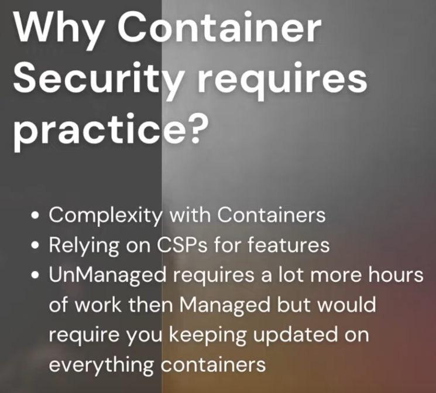
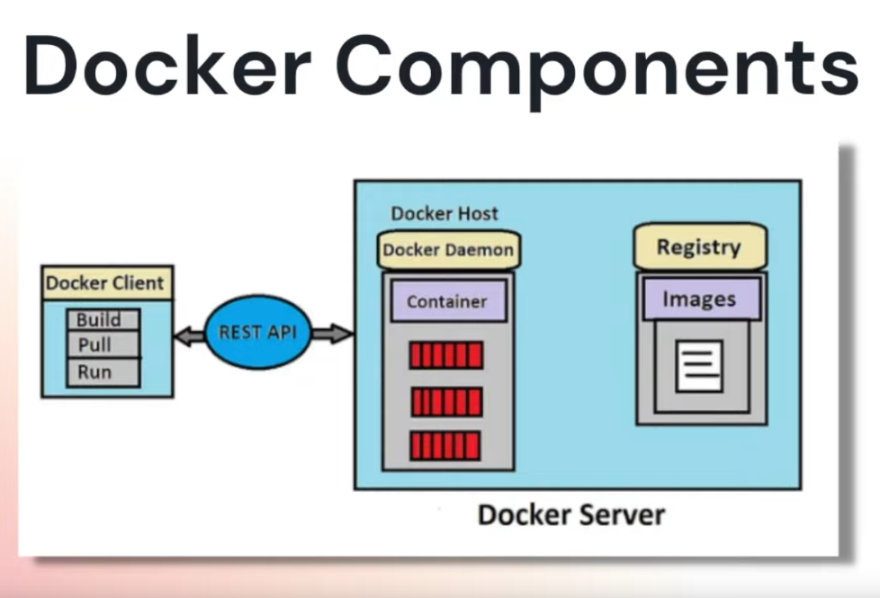

# Week 1 — App Containerization

## App Containerization (Live CLass)

- Containers are lightweight software components that bundle the application, its dependencies, and its configuration in a single image, running in isolated user environments on a traditional operating system on a traditional server or in a virtualized environment.

- The benefits of containerization :

  - Portability between different platforms and clouds—it’s truly write once, run anywhere.
  - Efficiency through using far fewer resources than VMs and delivering higher utilization of compute resources—see "Containers vs. VMs: What's the difference?" for a full comparison.
  - Agility that allows developers to integrate with their existing DevOps environment.
  - Higher speed in the delivery of enhancements. Containerizing monolithic applications using microservices helps development teams create functionality with its own life cycle and scaling policies.
  - Improved security by isolating applications from the host system and from each other.
  - Faster app start-up and easier scaling.
  - Flexibility to work on virtualized infrastructures or on bare metal servers
  - Easier management since install, upgrade, and rollback processes are built into the Kubernetes platform.

- Docker Hub : Is a container registry to host and share images (similar to github repos)
- OCI : Open Container Initiative
- JFROG for artifactory
- FROM scratch : empty image
- Each command in Dockerfile creates a layer
- Hyper Visor + Virtual Machines
- Dockerfile : A Dockerfile is a text document that contains all the commands a user could call on the command line to assemble an image.

```
FROM python:3.10-slim-buster

WORKDIR /backend-flask

COPY requirements.txt requirements.txt
RUN pip3 install -r requirements.txt

COPY . .

ENV FLASK_ENV=development

EXPOSE ${PORT}
# python3 -m flask run --host=0.0.0.0 --port=4567
# (-m:module)
CMD [ "python3", "-m" , "flask", "run", "--host=0.0.0.0", "--port=4567"]
```

- Build docker image : docker build -t backend-flask ./backend-flask (-t is tag)
- `docker run --rm -p 4567:4567 -it -e FRONTEND_URL='*' -e BACKEND_URL='*' backend-flask`

## App Containerization Pricing Considerations

### Cloud Development Env

1. GitPod

- Free Tier
  - Up to 50 hours/month
  - 4 cores, 8gb ram and 30gb storage
  - Avoid spinning multiple env at the same time

2. GitHub CodeSpaces

- Free Tier
  - Up to 60 hours/month (2 cores, 4gb ram, 15 gb of storage)
  - Up to 30 hours/month (4 cores, 8gb ram, 15 gb of storage)

3. Cloud9

- Free Tier

  - Covered under free tier until the validity of t2.micro (only one) instance in your account
  - Avoid using Cloud9 in case of free tier instance in use for other purpose

- Cloud Trail
  - logs all the API request (avoid cloud trail to be in free trail)
  - by default logs all the request for 90 days
  - KMS Enc not (chargeable)

## Docker Container Security Best Practice

- Container Security : is the practice of protecting your applications hosted on compute services like containers. Common examples of applications can be SPAs, Microservices, APIs etc.

- Why container security ?

  - Container first strategy (many companies follow)
  - Most apps are being developed with containers and cloud native.
  - Reducing impact of breach - segregation of applications and related services.
  - Managed container services means your security responsibility is focused on few things (AWS ECS, ECR)
  - Automation can reduce recovery times to a known good state fairly easy.

- Why container security requires practice ?

  - 

- Docker Components

  - 

## AWS Secret Manager

- store env secrets
- not all services have access
- Alt : Hashicorp Alt

## AWS Inspector / Clair

- scans images
- clair is open source(aws uses clair in behind)
- scan ecr, ec2 containers
